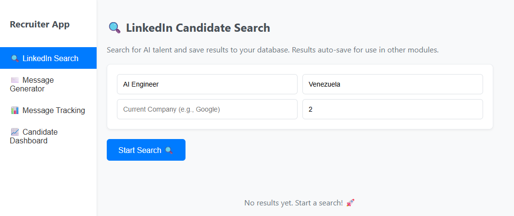
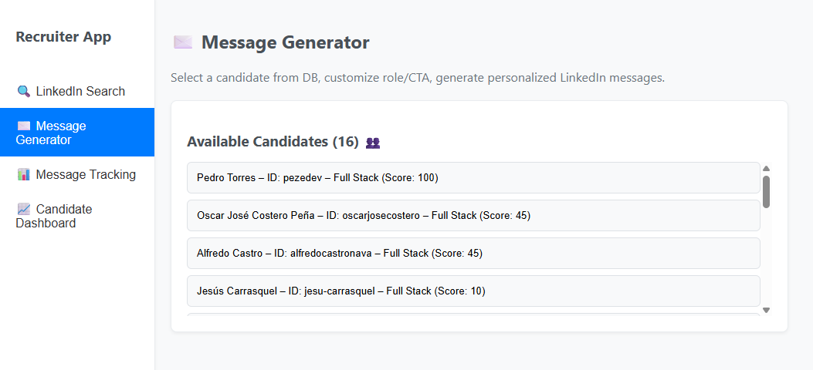
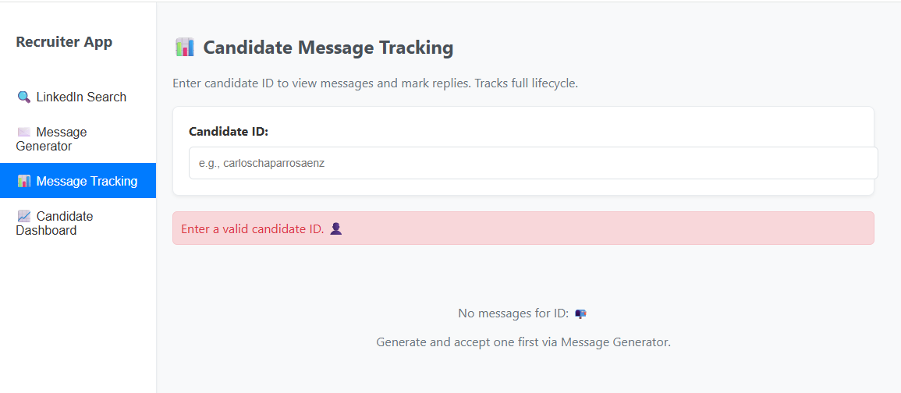
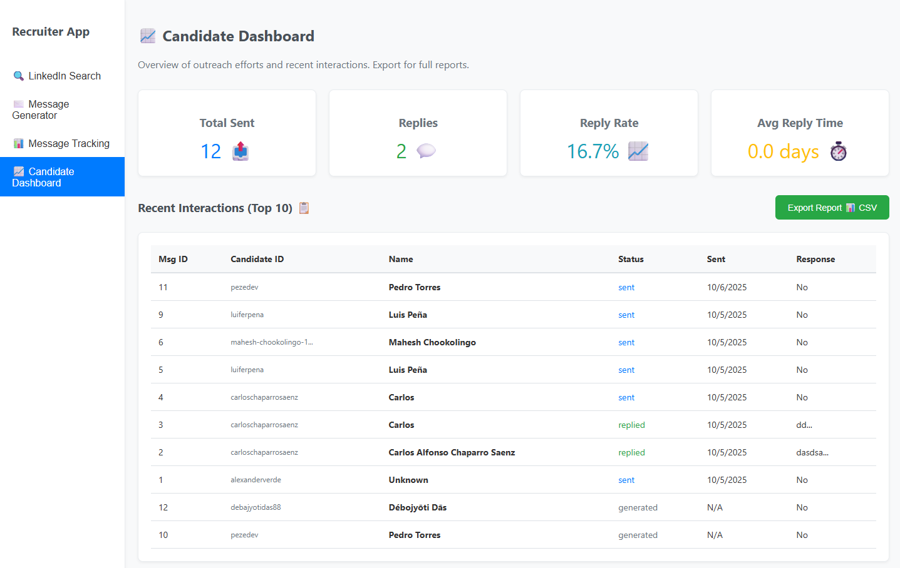
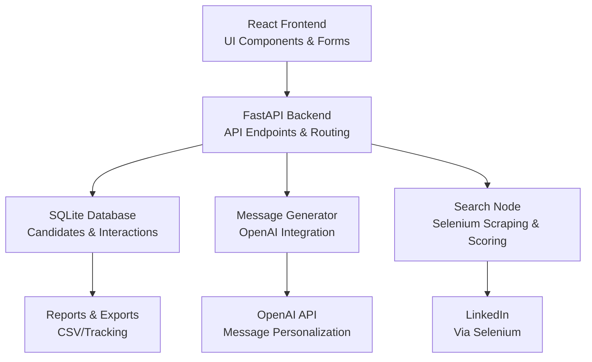

# 🔗 LinkedIn Automated Sourcing


[](https://choosealicense.com/licenses/mit/)
[](https://github.com/dcavadia)
[](https://www.linkedin.com/in/daniel-cavadia-82963615a/)

## 📑 Table of Contents

- [🔗 LinkedIn Automated Sourcing](#-linkedin-automated-sourcing)
  - [📑 Table of Contents](#-table-of-contents)
  - [🌟 Overview](#-overview)
  - [🚀 Getting Started](#-getting-started)
  - [✨ Features](#-features)
  - [🗂️ Project Structure](#️-project-structure)
    - [Mermaid Diagram](#mermaid-diagram)
  - [🛠 Tech Stack](#-tech-stack)
  - [🤝 Contributing](#-contributing)
  - [👨‍💻 Author](#-author)
  - [📄 License](#-license)

## 🌟 Overview

The **LinkedIn Automated Sourcing** is a modular full-stack platform for automated recruitment workflows. It integrates a FastAPI backend with a React frontend to handle LinkedIn scraping, candidate scoring, AI-driven message generation, and interaction tracking. The system uses Selenium for data extraction, OpenAI for personalization, and SQLite for persistence, enabling efficient sourcing for roles like AI Engineers through boolean searches, relevance scoring, and lifecycle management.

<!-- Thumbnails rendered at same width -->


> This preview shows the candidate search and scoring interface.



> This preview is from the latest message generation workflow.



> This preview is from the latest message tracking workflow.



> This preview displays the tracking dashboard for interactions.

## 🚀 Getting Started

1. **Clone the repository:**

```bash
git clone https://github.com/dcavadia/linkedin-automated-sourcing.git
cd linkedin-automated-sour
```

1. **Setup environment variables:**
   
- Copy `.env.example` to `.env` and fill in your details (see below).

2. **Install dependencies:**

- Backend (Python):
```
cd app
pip install -r requirements.txt
```

- Frontend (Node.js - requires npm):
```
cd ../frontend
npm install
```

3. **Run the backend:**

```bash
cd app
uvicorn main:app --reload --host 0.0.0.0 --port 8000
```

4. **Run the frontend:**

```bash
cd frontend
npm start
```


Access at `http://localhost:3000`. The backend runs at `http://localhost:8000`.

## 📖 User Manual

This section provides a step-by-step guide to using the application once it's running. The interface is intuitive, with a dashboard for navigation.

### 1. Logging In and Setup
- Open `http://localhost:3000` in your browser.
- The app starts on the **Dashboard** page. No login is required for local use (add authentication if deploying).
- Ensure your `.env` file has valid LinkedIn credentials and OpenAI API key. Restart the backend if changes are made.

### 2. Performing a Candidate Search
- Navigate to the **Search** tab.
- Enter a boolean query in the search form (e.g., `"AI Engineer" AND (Python OR TensorFlow) AND "Remote" AND >5 years`).
- Specify filters: Location (e.g., "USA"), Company (e.g., "Google"), Experience (e.g., 3-10 years).
- Click **Run Search**. The backend will:
- Log into LinkedIn via Selenium (progress shown in a loading spinner).
- Scrape profiles matching the query.
- Score candidates (0-100 based on keywords and fuzzy matches).
- Results appear in a table: Name, Profile URL, Score, Summary. High-scoring candidates (>70) are highlighted.

### 3. Viewing and Managing Candidates
- Go to the **Candidates** dashboard.
- View a paginated table of all saved candidates with scores and profiles.
- Click a candidate to see details: Full profile scrape, skills, experience.
- Export the list as CSV via the **Export** button (includes scores and contacts).

### 4. Generating and Sending Messages
- From the **Candidates** or **Messages** tab, select a candidate.
- Click **Generate Message** to use OpenAI to create a personalized outreach (prompt includes role description and candidate profile).
- Preview the message in the editor. Edit if needed (e.g., add company-specific details).
- Click **Send** to mark as sent (integrates with LinkedIn messaging via Selenium; track status manually for now).
- Messages are saved to the database for tracking.

### 5. Tracking Interactions
- Use the **Tracking** dashboard to view sent messages, responses, and timelines.
- Log responses manually: Click a message, select status (e.g., "Replied", "Ignored"), and add notes/timestamps.
- View metrics: Reply rate (e.g., 25% of 20 sent), average response time (e.g., 3 days).
- Filter by date range or candidate score.

### 6. Troubleshooting
- **Search Fails:** Check LinkedIn login in logs (common issues: CAPTCHA, invalid credentials). Use headless mode for production.
- **API Errors:** Visit `http://localhost:8000/docs` for interactive testing.
- **No Results:** Refine boolean query; ensure location/company fuzzy matching is enabled.
- **Rate Limits:** LinkedIn may block frequent scrapes—add delays in `search.py`.
- Restart services if database locks occur (SQLite is single-threaded).

For advanced usage, customize prompts in `message_generator.py` or add WebSocket notifications for real-time updates.

## ✨ Features

- **🔍 Automated LinkedIn Search:** Execute boolean queries for roles, locations, companies, and experience levels using Selenium.
- **📊 Candidate Scoring:** AI-powered matching with keywords, fuzzy logic for locations/companies, and experience estimation.
- **💬 Personalized Message Generation:** Generate tailored outreach messages using OpenAI based on role and candidate profiles.
- **📈 Message Tracking:** Monitor sent messages, responses, and statuses with real-time updates.
- **📋 Candidate Dashboard:** Visualize scored candidates, profiles, and interaction histories.
- **✏️ Message Generator UI:** Interactive editor for building, previewing, and sending messages.
- **🛡️ Robust Backend:** FastAPI with async handling, Selenium scraping, and SQLite for data persistence.
- **🎨 React Frontend:** Intuitive UI with forms, tables, charts, and progress indicators.
- **📤 Export & Reporting:** Generate CSV reports for candidates and interactions.
- **🔄 Real-time Updates:** WebSocket support for live search progress and notifications.
- **🧪 Observability:** Logging and metrics for scraping success rates and API health.

## 🗂️ Project Structure

### Mermaid Diagram




## 🛠 Tech Stack

- **Frontend:**
  - **Framework:** React with Axios for API calls
  - **Routing:** React Router
  - **UI:** Custom components with CSS modules

- **Backend:**
  - **Framework:** FastAPI for APIs & async endpoints
  - **Server:** Uvicorn
  - **Scraping:** Selenium WebDriver
  - **Parsing:** BeautifulSoup
  - **Concurrency:** asyncio

- **AI & Generation:**
  - **Model:** OpenAI GPT-2 for messages
  - **Scoring:** Custom fuzzy matching & keyword analysis

- **Data & Storage:**
  - **Database:** SQLite with SQLAlchemy
  - **Exports:** CSV generation

- **Utilities:**
  - **Config:** python-dotenv
  - **Validation:** Pydantic models

- **Dev Tools:**
  - **Package Mgmt:** pip (backend), npm (frontend)
  - **Health:** FastAPI docs at /docs
 
## 🔌 API Documentation

The backend exposes a RESTful API via FastAPI. Access interactive Swagger docs at `http://localhost:8000/docs` or ReDoc at `http://localhost:8000/redoc` for testing. All endpoints use JSON for requests/responses. Authentication is not implemented (add JWT for production).

### Base URL
`http://localhost:8000`

### Endpoints

| Endpoint | Method | Description | Request Body/Example | Response Example |
|----------|--------|-------------|----------------------|------------------|
| `/search` | POST | Run LinkedIn search with boolean query and save scored candidates. | `{ "query": "\"AI Engineer\" AND Python", "location": "USA", "experience_min": 3, "experience_max": 10 }` | `{ "status": "success", "candidates_found": 15, "avg_score": 75 }` [200] |
| `/candidates` | GET | Retrieve all candidates with pagination. | Query params: `?page=1&limit=20&min_score=70` | `[{ "id": 1, "name": "John Doe", "profile_url": "https://linkedin.com/in/johndoe", "score": 85, "summary": "AI Engineer at Google" }]` [200] |
| `/candidates/{id}` | GET | Get details for a specific candidate. | Path: `/candidates/1` | `{ "id": 1, "full_profile": "...", "skills": ["Python", "ML"] }` [200] |
| `/generate` | POST | Generate a personalized message for a candidate. | `{ "candidate_id": 1, "role_description": "Senior AI Engineer role focusing on CV" }` | `{ "message": "Hi John, I noticed your experience in computer vision at Google..." }` [200] |
| `/accept-message/{msg_id}` | POST | Mark a generated message as sent/accepted. | Path: `/accept-message/123` (empty body) | `{ "status": "accepted", "sent_at": "2025-10-06T02:00:00Z" }` [200] |
| `/track/{candidate_id}` | GET | Get tracking info (messages, responses) for a candidate. | Path: `/track/1` | `{ "messages": [...], "responses": [{ "status": "replied", "timestamp": "..." }] }` [200] |
| `/update-response` | POST | Log a response to a sent message. | `{ "message_id": 123, "status": "replied", "notes": "Interested in interview" }` | `{ "status": "updated" }` [200] |
| `/interactions` | GET | Get all message interactions with filters. | Query params: `?status=replied&date_from=2025-10-01` | `[{ "candidate_id": 1, "message": "...", "response_status": "replied" }]` [200] |
| `/metrics` | GET | Get overall metrics (reply rate, avg response time). | None | `{ "total_sent": 50, "reply_rate": 0.25, "avg_response_days": 3.2 }` [200] |
| `/export-report` | GET | Export CSV report of candidates/interactions. | Query params: `?type=candidates` | Download: `candidates_report.csv` [200] (file response) |
| `/health` | GET | Health check for backend services. | None | `{ "status": "healthy", "database": "connected" }` [200] |

- **Error Responses:** Standard HTTP codes (e.g., 400 for invalid query, 500 for scraping failures) with JSON: `{ "detail": "Error message" }`.
- **Rate Limiting:** Not enforced; add middleware for production to respect LinkedIn limits.
- **Async Endpoints:** Searches and generations are async; use WebSockets for progress (endpoint: `/ws/search`).

For full schemas, use the interactive docs. Extend with Pydantic models in `main.py`.

## 🤝 Contributing

Contributions are welcome! Please feel free to submit a Pull Request.

1. Fork the repository
2. Create your feature branch (`git checkout -b feat/AmazingFeature`)
3. Commit your changes (`git commit -m 'Add some AmazingFeature'`)
4. Push to the branch (`git push origin feat/AmazingFeature`)
5. Open a Pull Request

## 👨‍💻 Author

### Daniel Cavadia

- [GitHub](https://github.com/dcavadia)
- [LinkedIn](https://www.linkedin.com/in/daniel-cavadia-82963615a/)

## 📄 License

This project is licensed under the MIT License - see the [LICENSE](LICENSE) file for details.

---

<div align="center">

Built with ❤️ by [Daniel Cavadia](https://www.linkedin.com/in/daniel-cavadia-82963615a/)

</div>

